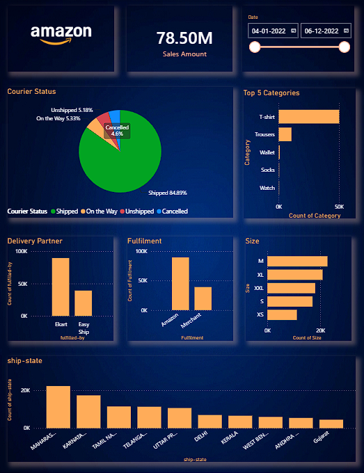

# 📦 Amazon Sales Tracker Dashboard – Excel + Power BI

> Analyzing Amazon.in sales trends, revenue performance, courier efficiency, and regional demand across India (Jan 2022 – Dec 2022).

---

## 🗂️ Overview

This project processes raw Amazon.in order data, cleans it in Excel using Power Query, and visualizes it in a mobile-optimized Power BI dashboard. It covers ₹78.50M in total sales across multiple product categories, delivery partners, fulfillment channels, and 10+ Indian states. The dashboard gives a clear picture of what sold, where it shipped, and how it moved.

---

## ❓ Problem Statement

Amazon sellers and analysts need a fast way to track:

- Which product categories generate the most revenue
- How courier and fulfillment partners perform
- Which states drive the highest order volume
- What size variants are most in demand
- Where cancellations and unshipped orders pile up

Without a visual tracker, these answers stay buried in raw CSV rows.

---

## 📁 Dataset

| Field | Details |
|---|---|
| Source | Amazon.in Sales Report (raw Excel) |
| Period | Jan 2022 – Dec 2022 |
| Records | 128,809 rows |
| Columns | 19 (Order ID, Date, Status, Fulfilment, Category, Size, Courier Status, Amount, Ship-State, etc.) |
| Currency | INR |
| Format | `.xlsx` |

**Key columns used:**
`Order ID`, `Date`, `Status`, `Fulfilment`, `Category`, `Size`, `Courier Status`, `Amount`, `ship-state`, `fulfilled-by`

---

## 🛠️ Tools & Technologies

| Tool | Purpose |
|---|---|
| Microsoft Excel | Raw data storage and initial review |
| Power Query (in Excel) | Data cleaning: removed duplicates, filled null values with 0, standardized column types |
| Microsoft Power BI Desktop | Dashboard building, slicers, and all visualizations |
| Power BI Mobile View | Dashboard layout optimized for mobile screens |

---

## ⚙️ Methods

1. **Data Import** – Loaded raw `.xlsx` into Excel for inspection
2. **Data Cleaning (Power Query)**
   - Removed duplicate Order IDs
   - Filled blank `Amount` and `Qty` fields with `0`
   - Standardized `Courier Status` and `Fulfilment` column values
   - Corrected inconsistent state name casing (e.g., `bangalore` → `KARNATAKA`)
3. **Data Loading** – Connected cleaned Excel file to Power BI
4. **Dashboard Design**
   - Built with a dark space-style theme matching Amazon's brand palette
   - Added a date slicer for dynamic filtering (Apr 01 – Jun 12, 2022)
   - Optimized layout for **mobile view** in Power BI
5. **Insight Extraction** – Identified top categories, dominant states, size preferences, and courier split

---

## 💡 Key Insights

- 💰 **Total Sales: ₹78.50M** across the tracked period
- 📦 **84.89% of orders were Shipped** successfully; only 4.62% Cancelled
- 👕 **T-shirt is the #1 category** by order count, followed by Trousers, Wallet, Socks, and Watch
- 🚚 **Ekart handles the majority** of fulfilled-by deliveries vs Easy Ship
- 🏭 **Amazon fulfillment outperforms Merchant** fulfillment in volume
- 📐 **Size M is the most ordered**, followed by XL, XXL, S, and XS
- 🗺️ **Maharashtra leads** all states in order volume, followed by Karnataka, Tamil Nadu, Telangana, and Uttar Pradesh
- 🔴 **5.18% orders remain Unshipped** and **5.33% are On the Way**, indicating active pipeline at snapshot time

---

## 📊 Dashboard / Output



The dashboard includes:

- KPI Card: Total Sales Amount (₹78.50M)
- Pie Chart: Courier Status breakdown (Shipped / On the Way / Unshipped / Cancelled)
- Bar Chart: Top 5 Categories by order count
- Bar Charts: Delivery Partner split and Fulfilment type split
- Horizontal Bar Chart: Size distribution
- Column Chart: State-wise shipment volume (ship-state)
- Date Range Slicer: Apr 01, 2022 – Jun 12, 2022

> 📱 This dashboard was built and optimized in **Power BI Mobile View** for easy viewing on smartphones.

---

## 🚀 How to Run This Project

### Prerequisites

- Microsoft Excel (2016 or later)
- Power BI Desktop (free – [download here](https://powerbi.microsoft.com/desktop/))

### Steps

```bash
1. Clone this repository
   git clone https://github.com/YOUR_USERNAME/amazon-sales-tracker.git

2. Open Amazon_sales_xlsx.xlsx in Excel
   - Review the raw data and Power Query steps (Data > Queries & Connections)

3. Open Amazon_Power_Bi_live.pbix in Power BI Desktop
   - If prompted, update the data source path to your local Excel file
   - Click Refresh to reload data

4. Explore the dashboard
   - Use the date slicer to filter by time range
   - Click any chart element to cross-filter other visuals
```

---

## 📈 Results & Conclusion

The dashboard confirms that Maharashtra, Karnataka, and Tamil Nadu are Amazon.in its top three revenue-contributing states for apparel. T-shirts dominate sales volume; the medium size is the most popular, and Ekart is the primary last-mile delivery partner. Amazon's own fulfillment center significantly outperforms merchant fulfillment. The 4.62% cancellation rate is low, but the 5.18% unshipped orders flag a logistics gap worth monitoring.

This project proves that even without DAX, Power BI with a clean Excel source produces business-grade insights for e-commerce operations.

---

## 🔮 Future Work

- Add a month-over-month revenue trend line to track growth across quarters
- Integrate DAX measures for average order value and return rate
- Build a separate page for B2B vs B2C order segmentation
- Add drill-through by state to city-level analysis
- Connect to live Amazon Seller Central API for real-time refresh
- Add forecasting visual for the next 30-day demand prediction by category

---

## 👤 Author & Contact

**Gulfam Raza**
🎓B.Tech – Information Technology, RKGIT Ghaziabad

🏆 **CGPA: 8.02 | First Division with Distinction**

Specialization: Data Analytics & its related roles.

| Platform | Link |
|---|---|
| 📧 Email | razagulfam0786@gmail.com |
| 💼 LinkedIn | [linkedin.com/in/your-profile](https://www.linkedin.com/in/gulfamraza1) |
| 📱 Mobile | +91-6395528887 |

---

⭐ If this project helped you, give it a star on GitHub!
